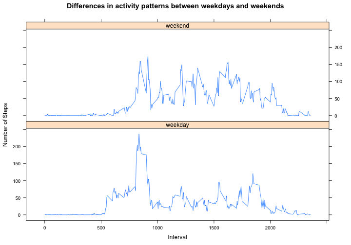

# Reproducible Research: Peer Assessment 1

## Settings and libraries

```r
Sys.setlocale("LC_TIME", "en_US")
```

```
## [1] "en_US"
```

```r
library(lattice)
```


## Loading and preprocessing the data

We import the data from the .csv file and store it in a data frame.

```r
raw_data <- read.csv("activity.csv")
data <- raw_data
```


We create an additional column indicating which day of the week is the date

```r
day_of_week <- weekdays(strptime(data$date, format = "%Y-%m-%d"))
data <- cbind(data, day_of_week)
```


## What is mean total number of steps taken per day?

We aggregate the steps made for each day and transform the date format to display it properly

```r
sum_by_day <- aggregate(steps ~ date, data, sum)
sum_by_day$date <- strptime(sum_by_day$date, format = "%Y-%m-%d")
```


```r
plot(sum_by_day$date, sum_by_day$steps, type = "h", main = "Total Quantity of Steps by Day", 
    xlab = "", ylab = "Total Number of Steps")
mean_steps <- mean(sum_by_day$steps)
median_steps <- median(sum_by_day$steps)
abline(h = mean_steps, col = "red")
abline(h = median_steps, col = "green")
legend("topleft", c("Mean Number of Steps per Day", "Median Number of Steps per Day"), 
    col = c("red", "green"), lty = c(1, 1), lwd = c(1, 1), bty = "n")
```

 


We can notice that mean and median of the total number of steps made by day are almost identical and their difference is not visible on the plot.

## What is the average daily activity pattern?

We aggregate the mean quantity of steps made for each 5 minutes interval and plot the result

```r
avg_by_interval <- aggregate(steps ~ interval, data, mean)
plot(avg_by_interval$interval, avg_by_interval$steps, type = "l", main = "Average Quantity of Steps by Interval", 
    xlab = "Interval", ylab = "Average Number of Steps")
```

 


The maximum average activity is observed for the following interval

```r
max_avg_step <- max(avg_by_interval[, 2])
max_activity_interval <- avg_by_interval[avg_by_interval[, 2] == max_avg_step, 
    1]
print(max_activity_interval)
```

```
## [1] 835
```

This corresponds to the 8.35-8.39 am interval. This guy is probably going to work by foot (at least to a subway station...).

## Imputing missing values

The total number of rows with missing values is

```r
sum(is.na(data$steps))
```

```
## [1] 2304
```


There are no missing values for other columns

```r
sum(is.na(data$date)) + sum(is.na(data$interval))
```

```
## [1] 0
```


Missing activity has a particular pattern:
- either a day has complete data (53 days)
- or no data at all (8 days)

```r
missing_data <- data[is.na(data$steps), ]
aggregate(interval ~ date, missing_data, length)
```

```
##         date interval
## 1 2012-10-01      288
## 2 2012-10-08      288
## 3 2012-11-01      288
## 4 2012-11-04      288
## 5 2012-11-09      288
## 6 2012-11-10      288
## 7 2012-11-14      288
## 8 2012-11-30      288
```

```r
present_data <- data[!is.na(data$steps), ]
aggregate(interval ~ date, present_data, length)
```

```
##          date interval
## 1  2012-10-02      288
## 2  2012-10-03      288
## 3  2012-10-04      288
## 4  2012-10-05      288
## 5  2012-10-06      288
## 6  2012-10-07      288
## 7  2012-10-09      288
## 8  2012-10-10      288
## 9  2012-10-11      288
## 10 2012-10-12      288
## 11 2012-10-13      288
## 12 2012-10-14      288
## 13 2012-10-15      288
## 14 2012-10-16      288
## 15 2012-10-17      288
## 16 2012-10-18      288
## 17 2012-10-19      288
## 18 2012-10-20      288
## 19 2012-10-21      288
## 20 2012-10-22      288
## 21 2012-10-23      288
## 22 2012-10-24      288
## 23 2012-10-25      288
## 24 2012-10-26      288
## 25 2012-10-27      288
## 26 2012-10-28      288
## 27 2012-10-29      288
## 28 2012-10-30      288
## 29 2012-10-31      288
## 30 2012-11-02      288
## 31 2012-11-03      288
## 32 2012-11-05      288
## 33 2012-11-06      288
## 34 2012-11-07      288
## 35 2012-11-08      288
## 36 2012-11-11      288
## 37 2012-11-12      288
## 38 2012-11-13      288
## 39 2012-11-15      288
## 40 2012-11-16      288
## 41 2012-11-17      288
## 42 2012-11-18      288
## 43 2012-11-19      288
## 44 2012-11-20      288
## 45 2012-11-21      288
## 46 2012-11-22      288
## 47 2012-11-23      288
## 48 2012-11-24      288
## 49 2012-11-25      288
## 50 2012-11-26      288
## 51 2012-11-27      288
## 52 2012-11-28      288
## 53 2012-11-29      288
```


We store these dates for further use

```r
missing_dates <- as.vector(aggregate(interval ~ date, missing_data, length)$date)
missing_dates <- strptime(missing_dates, format = "%Y-%m-%d")

present_dates <- as.vector(aggregate(interval ~ date, present_data, length)$date)
present_dates <- strptime(present_dates, format = "%Y-%m-%d")
```


A strategy for filling missing data is to take for each missing data the activity mean for this particular day of the week and this particular interval 

We create a new dataframe containing the average activity for each day of the week and each interval

```r
avg_by_day_and_interval <- aggregate(steps ~ interval + day_of_week, present_data, 
    mean)
avg_by_day_and_interval$steps <- round(avg_by_day_and_interval$steps, digits = 0)
```


We create a new dataframe from data and fill it in according to the strategy

```r
filled_data <- data
for (i in 1:nrow(missing_data)) {
    # Loop in all missing data
    date <- missing_data[i, ]$date  # This is the date with missing data
    day_of_week <- missing_data[i, ]$day_of_week  # This is the day of the week corresponding to the date 
    interval <- missing_data[i, ]$interval  # This is the interval for which we are looking for a value
    steps <- avg_by_day_and_interval[avg_by_day_and_interval$interval == interval & 
        avg_by_day_and_interval$day_of_week == day_of_week, ]$steps  # This is the average number of steps for this day of the week and this interval
    filled_data[filled_data$date == date & filled_data$interval == interval, 
        ]$steps <- steps
    # we fill the missing value with this average
}
```


We check that there are no more missing values in the filled data frame

```r
sum(is.na(filled_data$steps)) + sum(is.na(filled_data$date)) + sum(is.na(filled_data$interval))
```

```
## [1] 0
```


We aggregate the total number of steps made for each date and plot it

```r
filled_sum_by_day <- aggregate(steps ~ date, filled_data, sum)
filled_sum_by_day$date <- strptime(filled_sum_by_day$date, format = "%Y-%m-%d")
plot(filled_sum_by_day$date, filled_sum_by_day$steps, type = "h", main = "Total Quantity of Steps by Day (with filled values)", 
    xlab = "", ylab = "Total Number of Steps")
filled_mean_steps <- mean(filled_sum_by_day$steps)
filled_median_steps <- median(filled_sum_by_day$steps)
abline(h = mean_steps, col = "red")
abline(h = filled_mean_steps, col = "blue")
legend("topleft", c("Mean Number of Steps per Day (with missing values)", "Mean Number of Steps per Day (with filled values)"), 
    col = c("red", "blue"), lty = c(1, 1), lwd = c(1, 1), bty = "n")
```

 


There is not a huge difference for means and medians before or after imputing missing data.
Nevertheless we can notice that both are slightly higher when imputing missing data.


```r
mean_steps
```

```
## [1] 10766
```

```r
filled_mean_steps
```

```
## [1] 10821
```

```r
median_steps
```

```
## [1] 10765
```

```r
filled_median_steps
```

```
## [1] 11015
```


One hypothesis is that missing dates are typically days with higher than average activity.

We calculate the mean and the median for the total number of steps made for each day of the week (using only real data and not filled ones)

```r
sum_by_day <- cbind(sum_by_day, day_of_week = weekdays(sum_by_day$date))  # We add a day of the week column
mean_by_week_of_day <- aggregate(steps ~ day_of_week, sum_by_day, mean)
median_by_week_of_day <- aggregate(steps ~ day_of_week, sum_by_day, median)
```


```r
plot(sum_by_day$day_of_week, sum_by_day$steps, main = "Number of steps by day of the week", 
    ylab = "Total number of steps")
```

 


We can compare these means and medians by day of the week with the general mean and median  

```r
mean_by_day_of_week <- cbind(mean_by_week_of_day, diff = mean_by_week_of_day$steps - 
    mean_steps)
median_by_day_of_week <- cbind(median_by_week_of_day, diff = median_by_week_of_day$steps - 
    median_steps)
mean_by_day_of_week[order(mean_by_day_of_week$diff, decreasing = TRUE), ]
```

```
##   day_of_week steps    diff
## 3    Saturday 12535  1769.2
## 1      Friday 12360  1593.5
## 4      Sunday 12278  1511.5
## 7   Wednesday 11791  1024.6
## 2      Monday  9975  -791.3
## 6     Tuesday  8950 -1816.6
## 5    Thursday  8213 -2553.4
```

```r
median_by_day_of_week[order(median_by_day_of_week$diff, decreasing = TRUE), 
    ]
```

```
##   day_of_week steps  diff
## 3    Saturday 12426  1661
## 7   Wednesday 12070  1304
## 4      Sunday 11834  1069
## 1      Friday 11829  1064
## 2      Monday 10439  -326
## 6     Tuesday  8918 -1847
## 5    Thursday  8552 -2214
```


Missing data is observed for the following days of the week:

```r
missing_days_of_week <- as.data.frame(table(weekdays(missing_dates)))
missing_days_of_week
```

```
##        Var1 Freq
## 1    Friday    2
## 2    Monday    2
## 3  Saturday    1
## 4    Sunday    1
## 5  Thursday    1
## 6 Wednesday    1
```


Typically, activity is higher than average on Saturdays, Wednesdays, Sundays and Fridays. 
Monday's activity is slightly less than average
Days with less activity are Tuesdays and Thursdays.

According to these figures, we can conclude that the difference for mean and median between original data and filled data is due to the days of the week for which there are missing data.


## Are there differences in activity patterns between weekdays and weekends?

We add a new column to filled_data indicating if the date corresponds to a weekday or is a weekend day

```r
we_or_not_we <- rep("weekday", nrow(filled_data))
we_or_not_we[filled_data$day_of_week == "Saturday" | filled_data$day_of_week == 
    "Sunday"] <- "weekend"
we_or_not_we <- as.factor(we_or_not_we)
filled_data <- cbind(filled_data, we_or_not_we)
```


We aggregate the data to get the mean by type of day and interval and plot a panel plot

```r
filled_sum_by_type_of_day <- aggregate(steps ~ interval + we_or_not_we, filled_data, 
    mean)
xyplot(steps ~ interval | we_or_not_we, main = "Differences in activity patterns between weekdays and weekends", 
    ylab = "Number of Steps", xlab = "Interval", data = filled_sum_by_type_of_day, 
    type = "l", layout = c(1, 2))
```

 


We can notice that during weekends the activity is slightly more constant during the day. There is no such morning peak as for week days.


```r
Sys.setlocale("LC_TIME", "fr_FR")
```

```
## [1] "fr_FR"
```

